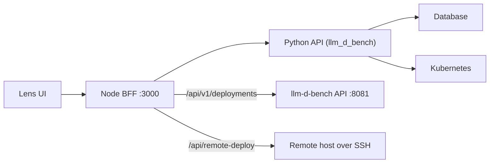

Lens 通过 Node BFF 暴露一个同源 HTTP API；浏览器只调用
`/api/...` 路径，Vite 会在开发环境中将其代理到 Node 后端。
Node 后端将领域调用转发给 Python FastAPI 后端（`llm_d_bench`），
后者负责校验、持久化和任务执行。



## 接口

| 接口 | 说明 |
| --- | --- |
| Node BFF | 浏览器使用的同源 `/api/...` 路由；代理到 Python API，并托管 MCP 工具。 |
| Python API | 用于部署、模拟、评估、存储、监控和认证的 FastAPI 路由。 |
| MCP 工具 | 从后端路由生成、可供助手调用的操作，纳入 MCP 目录。 |
| Kubernetes 后端 | 通过官方 Python 客户端进行的服务端 Kubernetes 访问，支持 CLI 回滚。 |

## 模块

每个 Lens 模块都有一个专属页面，涵盖其后端 HTTP 端点，
以及（如果存在的话）如何直接调用其 Python 服务层
（供内部脚本、测试或自动化使用）而不是通过 HTTP：

<CardGroup cols={3}>
  <Card title="模型市场" href="/api-reference/modules/model-market">目录交接（仅前端目录）。</Card>
  <Card title="部署" href="/api-reference/modules/deployments">运行、执行、用例、访问权限。</Card>
  <Card title="评估" href="/api-reference/modules/evaluation">引导式基准测试任务。</Card>
  <Card title="模拟" href="/api-reference/modules/simulation">基于轨迹的模拟运行。</Card>
  <Card title="模型服务" href="/api-reference/modules/model-services">网关、提供方、选择策略。</Card>
  <Card title="集群" href="/api-reference/modules/clusters">注册、引导、概览。</Card>
  <Card title="存储" href="/api-reference/modules/storage">存储卷和存储后端。</Card>
  <Card title="模型缓存" href="/api-reference/modules/model-cache">已缓存的模型制品。</Card>
  <Card title="外部服务提供方" href="/api-reference/modules/external-providers">第三方 AI 提供方。</Card>
  <Card title="可观测性" href="/api-reference/modules/observability">加速器、集群监控栈、GPU 驱动、性能分析。</Card>
  <Card title="Lens Assistant" href="/api-reference/modules/lens-assistant">Node MCP 工具目录。</Card>
  <Card title="管理" href="/api-reference/modules/administration">认证、RBAC 和系统设置。</Card>
</CardGroup>

每个 Python 后端端点也都记录在生成的 FastAPI OpenAPI schema 中。
在后端路由发生变化后，重新生成它：

```bash
source .venv/bin/activate
npm run docs:api
```

## 约定

每一个新增或修改的、可供外部调用的 API（FastAPI 路由、HTTP 处理器、
RPC/MCP 工具及其请求/响应契约）都必须使其描述与实际实现的行为、
校验逻辑、授权、默认值、状态码和 schema 保持一致。参见
`.github/instructions/api-documentation.instructions.md` 中仓库对
API 描述的要求。
