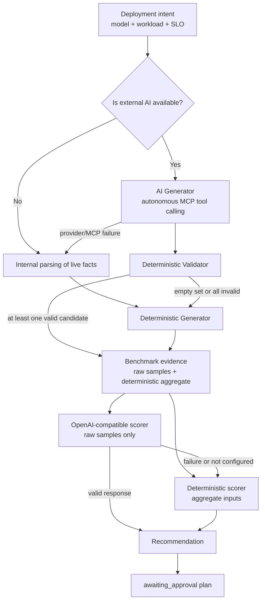
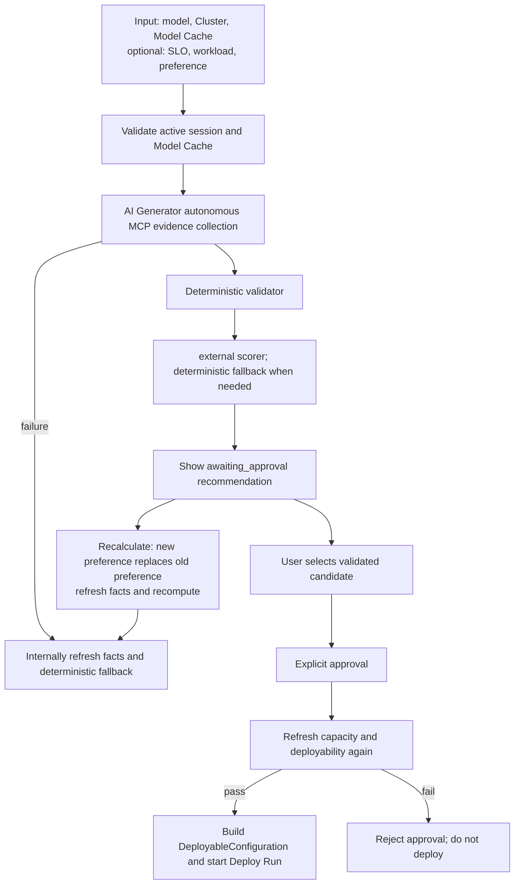
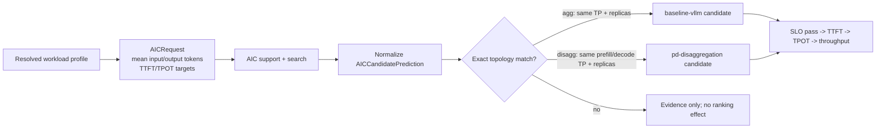

# 智能体部署架构与工作流

本文档描述了 Lens 智能体部署（Agentic Deployment）的规划器分层结构、端到端工作流、
当前约束以及未来演进方向。
Agentic 的职责是在受限条件下生成候选方案、执行确定性校验、对其评分并编排审批流程。
它并非能够生成任意 Kubernetes 配置的通用型智能体。

## 规划器整体架构



当配置了外部 AI 时，`AICandidateGenerator` 会首先运行。模型会接收到一份受限的 MCP 工具
模式（schema），并且第一批实际工具调用必须、也只能并行调用集群概览与 AIC 候选搜索。
集群结果是不可覆盖的硬性约束。系统必须尝试调用 AIC，但如果其推荐结果不可用、
指标不完整，或未满足显式 SLO，则会被丢弃；这些推荐不会阻塞有效的非 AIC 候选方案。
服务器会对同一轮 MCP 返回的事实进行归一化处理，随后由 `CandidateValidator` 独立
重新计算显存（VRAM）、GPU 和 CPU 缓冲区。只有经过校验的候选方案才能被展示、评分、
选中或部署。当部分候选方案无效时，系统会保留其余有效候选方案，并且不会触发回退。

对于每个可行的提供方（provider），AI Generator 必须首先提出资源占用最小的拓扑结构：
即满足显存约束的最低张量并行度（TP），以及每个服务角色一个副本。用户偏好仅用于
选择提供方/方法；它本身不能作为采用更大 TP 或更多副本的依据。更大的拓扑结构需要
显式 SLO，或完整的 AIC 预测数据来证明确有此需要。

AIC 仅适用于聚合（aggregated）与分离（disaggregated）两类拓扑。对于其他 Guide
（部署方案），AIC 状态为 `not_applicable`（不适用）；缺失预测数据是中性信息，
而非失败的证据。这些 Guide 不会因此被过滤或降权，跨 Guide 的排序仍然首先遵循
用户偏好以及与工作负载/Guide 的匹配度。AIC 只是在适用且可比较的拓扑范围内的
一个次要正向信号。

当没有外部 AI、提供方/MCP 不可用、AI 输出无效/为空，或所有 AI 候选方案均无效时，
`DeterministicPlanner`（确定性规划器）会继续提供生成层面的回退，并且始终为评分
提供一个稳定的回退方案。

`OpenAICompatiblePlanner` 是一个可选的评分层，它不会生成、修改或扩展候选方案
集合。当该层已配置且可用时，它会接收每一个通过提供方/拓扑及实时资源硬性约束的
候选方案，每个候选方案最多附带五条原始历史基准测试样本。它必须返回得分最高的
三个候选方案（若不足三个则返回全部）及其评分。服务器会校验候选方案的边界、
唯一性、评分完整性以及最高分一致性。外部层不会收到 `PerformanceScoreInput`、
聚合置信度、$N_{eff}$、基准测试 SLO 结论或确定性排序结果。一旦该层失败，
则直接使用确定性结果。

实时集群容量始终是优先级最高的硬性约束。外部 AI 可以提出候选方案，但 AIC、
历史模拟（Simulation）数据和外部 AI 都不能覆盖校验器、配置契约或审批流程，
也不能直接触发部署。

## 端到端工作流



1. 用户首先在模型市场（Model Market）中选择模型、目标集群以及模型缓存存储；
   部署名称与 vLLM 参数会随请求一并提交。SLO、工作负载画像和偏好均为可选输入。
2. 创建方案时，后端会校验当前的活动集群会话，并验证所选存储对当前集群是否就绪、
   其用途是否为 `model-cache`、是否不是动态 PVC 卷，以及是否已针对目标模型拥有
   一个就绪的缓存条目。
3. 当配置了外部 AI 时，AI Generator 会从部署意图出发，使用原生工具调用功能，
   首先并行查询集群与 AIC；只有在此之后，它才可以查询白名单范围内的历史证据。
   在提交之前，它必须获取集群概览并至少尝试一次 AIC 搜索。服务器会对该轮 MCP
   返回的事实进行归一化，过滤掉无效的 AIC 预测或违反显式 SLO 的预测，
   然后交由校验器独立过滤候选方案。
4. 当未配置 AI、提供方/MCP 不可用，或输出无效时，`resolve_planning_facts()`
   会通过内部领域服务刷新事实，然后运行确定性生成器（Deterministic Generator）；
   当所有 AI 候选方案均无效时，它会复用已归一化的 MCP 事实来生成确定性候选方案。
5. 服务器会为每个经过校验的候选方案维护两份内部视图：供确定性评分器使用的
   候选方案级基准测试聚合数据，以及供外部评分器使用的原始历史样本。
   如果外部评分失败，则使用带聚合证据的确定性评分器。
6. 推荐结果会保持在 `awaiting_approval`（等待审批）状态。用户可以选择另一个
   经过校验的候选方案，或点击“重新计算”。重新计算时提供的新偏好会**替代**
   旧偏好，并重新加载实时事实与候选方案；它不会保留上一轮的偏好设置。
7. 只有在用户明确批准之后，部署才会启动。在批准之前，系统会再次校验资源情况
   及候选方案的可部署性，以避免使用过时的方案。

## UI 输入与交互

UI 只是上述工作流的输入与审阅界面。其入口分别是 `src/components/ModelMarketPage.jsx`
和 `src/components/AgenticDeploymentWorkspace.jsx`：

- 模型缓存存储紧跟在模型市场中的“集群”选项之下，Standard（标准）模式与 Agentic
  （智能体）模式共用该选项；用户可以先进入 Agentic 模式，必填字段的校验仅在
  生成推荐结果时才会执行。
- Agentic 工作区提供使用场景（Use case）、可选的 SLO/工作负载/偏好输入，
  以及备选方案、评分来源和证据展示。
- 初始响应会展示得分最高的三个候选方案；外部规划器同样最多返回三个候选方案。
- 用户只能从已有的可部署候选方案中进行选择；无法通过 UI 或提示词提交新的
  提供方、TP、副本数量或 CLI 参数。

## 实现细节与约束

### 实时事实解析

**当前实现**

`llm_d_bench.agentic.facts.resolve_planning_facts()`：

1. 校验并读取当前的活动集群会话；
2. 调用集群概览以获取每块 GPU 的显存、空闲 GPU 数量以及可用 CPU 缓冲区；
3. 使用 `resolve_workload_signals()` 对已测得的工作负载画像或使用场景回退值
   进行归一化；
4. 收集 AIC 支持/搜索情况、部署历史总次数，以及来自同一模型已完成模拟运行
   的历史性能度量数据和已持久化的部署拓扑；
5. 冻结集群快照与证据 ID，并将其传递给规划器。

在冻结事实之前，未来的一个步骤将根据用户的使用场景、已解析的工作负载、
目标模型和加速器类型，生成带版本号、考虑不确定性的 `UseCasePerformanceEstimate`
值（TTFT、TPOT、工作负载容量）。当缺少工作负载数据时，一个带版本号的使用场景
映射表会生成查询画像；缺少必需字段会导致历史记录无法成为高相似度的性能证据。
显式 SLO 具有优先权；只有在相应 SLO 缺失时，这些估算值才会成为生成、检索和
评分阶段的软性目标。检索器会在 `match_similarity` 中纳入相对于这些目标的
最弱 TTFT/TPOT/容量实测拟合度：即使模型/硬件/工作负载匹配，若性能与目标相差
甚远，也无法产生高相似度。估算值不能覆盖实时容量或校验器的判定。

**当前回退策略**

- 当集群概览无法获取可用 GPU 数量或显存信息时，规划将失败；用户提交的资源数值
  不会被用来替代实时事实。
- 当 AIC、部署历史或模拟检索失败时，相应证据会被记录为 `unavailable`（不可用）；
  实时资源校验与确定性规划继续进行。

针对同一个模型，系统会选取工作负载相似度最高的最多三条观测记录，其中携带
TTFT P95、TPOT P95、吞吐量，以及从已持久化部署配置中解析出的提供方/拓扑信息。
这些是独立的规划证据：它们既不会替代基准测试聚合数据，也不会缩小外部评分器的
候选方案集合。没有已持久化拓扑关联的历史记录无法生成候选方案。

**计划中的实现**

- 将 Deploy/Evaluate/Simulation 的原始结果归一化为带版本号的 `BenchmarkRecord`。
- 引入 `BenchmarkEvidenceRetriever`，以应用硬件、运行时版本和时间衰减因素，
  并生成候选方案级别的置信度、负面证据以及可追溯的引用。

### 有界候选方案与硬性约束

**当前实现**

`llm_d_bench.agentic.planner.DeterministicPlanner` 只会生成可以映射到 Deploy 的
已注册提供方：

- `baseline-vllm`
- `optimized-baseline`
- `pd-disaggregation`
- `tiered-prefix-cache`
- `precise-prefix-cache-routing`

候选方案枚举使用固定的 TP 取值：`1, 2, 4, 8, 16`；以及固定的副本数量取值：
`1, 2, 4`。每个候选方案都必须满足：

$$
footprint_{GiB} = 1.2 \times model\_weight_{GiB}
+ \max(1, context\_length / 4096)
$$

$$
footprint_{GiB} \leq 0.9 \times vram\_per\_gpu_{GiB} \times TP
$$

此外还必须满足所需 GPU 数量不超过实时空闲 GPU 数量，且 CPU 缓冲区不低于所需的
最小值。对于 PD（预填充/解码分离）候选方案，所需 GPU 数量会分别对预填充与
解码两类资源进行计算。

**当前回退策略**

- 当没有候选方案满足硬性约束时，返回 `cannot_satisfy`，并附带全部拒绝原因，
  不会调用外部提供方或执行部署。
- 缓存/路由类候选方案始终包含在有界方案目录中；共享前缀信号、使用场景和
  用户偏好只会影响排序或外部模型的选择。当 CPU 缓冲区不足时，分层缓存类
  候选方案同样会被判定为不可部署。

**计划中的实现**

- 为节点/放置策略、运行时能力、存储以及 vLLM 参数白名单增加二次校验。
- 用“拓扑 + 能力集合”取代当前互斥的 `provider_ref`，以表达诸如 PD + 缓存/
  卸载这类组合型优化方案。

### 确定性排序、工作负载与 AIC

**当前实现**

使用场景与工作负载画像只影响候选方案的优先级；它们并非候选方案生成或资源校验的
硬性阈值。显式偏好中的提供方映射优先于通用的工作负载启发式规则；否则，当共享
前缀比例不低于 $0.5$，或用户偏好明确要求缓存/路由方案时，优先选择分层缓存/路由；
当工作负载以预填充为主时，优先选择 PD 方案；其余情况下优先选择优化后的基线方案。
当工作负载画像未经实测时，`code-generation`（代码生成）默认 `shared_prefix_ratio=0.6`，
`long-inputs`（长输入）与 `summarization`（摘要）默认 `prefill_heavy=true`；
现有请求中显式提供的旧字段仍然有效。

AIC 的集成方式是受控且精确的：



- AIC 的 `agg` 只与具有相同 TP 和副本数的 `baseline-vllm` 相匹配。
- AIC 的 `disagg` 只与预填充/解码 TP 及副本数均完全一致的 `pd-disaggregation`
  相匹配。
- 当未设置 TTFT/TPOT SLO 时，所有精确匹配 AIC 预测的候选方案都会排在纯粹基于
  工作负载启发式规则的候选方案之前，并按 TTFT、TPOT 和吞吐量排序。
- 当设置了 TTFT 或 TPOT SLO 其中之一时，只有具备精确预测且满足全部已配置目标的
  AIC 候选方案才会排在最前；其次是没有 AIC 预测的候选方案；AIC 预测明显未达到
  SLO 的候选方案则排在它们之后。
- 同一层级内的平局情况仍然通过工作负载 Guide、GPU 数量、TP 和副本数的稳定
  排序规则来打破。

**当前回退策略**

- 如果 AIC 不支持该模型、返回空结果、调用失败、指标缺失，或结果无法精确映射到
  某个 Lens 候选方案，则现有的工作负载启发式规则和资源成本排序将继续生效。
- 缓存/路由类 Guide 不会因 AIC 预测而获得排序加成，以避免将针对不匹配拓扑的
  预测误标为事实。
- 如果某候选方案未通过显存、空闲 GPU 或 CPU 缓冲区检查，AIC 预测无法使其
  变为可部署。

**当前基准测试集成方式**

- `BenchmarkEvidenceRetriever` 会计算模型、硬件、工作负载和配置的相似度，
  以及时间/运行时衰减因子。`BenchmarkPerformanceEvidence.score_inputs()` 会将
  结果转换为候选方案级别的 `PerformanceScoreInput`。
- 确定性评分会优先考虑阻断性失败、历史 SLO、置信度、$N_{eff}$ 和聚合指标，
  其优先级高于 AIC。AI 评分接收到的是经过排序的原始样本，而非这些聚合数据。

**计划中的实现**

- 将 AIC、历史数据与模拟数据统一整合为候选方案级别的 `PredictionEvidence`，
  并保留其来源、模式/生产者版本、置信度、检索参数及引用信息。
- 为稳定的确定性层增加完整的 SLO 硬性门限、不确定性惩罚、冲突降权以及
  帕累托前沿（Pareto frontier）分析。
- 为受控的云端基准测试报告构建 RAG 投影。只有经过检索、来源校验且完整解析的
  报告才会在规划请求内被临时归一化为 `BenchmarkRecord`；不会将其持久化。
  计算方式与本地记录相同的 `match_similarity`，并为每个候选方案提供最多五条
  排序后的原始证据样本。
- 让 `UseCasePerformanceEstimate` 在生成阶段约束最小可行拓扑，并在缺少 SLO 时
  充当软性目标。在 `match_similarity` 中纳入最弱的实测 TTFT/TPOT/工作负载容量
  拟合度；不确定的估算值不得产生高相似度证据。

### 可选的 OpenAI 兼容选择层

**当前实现**

`OpenAICompatiblePlanner` 会接收通过硬性约束的完整候选方案目录以及规划事实，
但不包含聚合历史证据。通过一次严格的 JSON 模式（schema）调用，从中选出得分
最高的三个已有 ID（若不足三个则选出全部）并为每个被选中的候选方案评分。
对于不完全支持严格模式的提供方，模式校验失败后会回退为要求相同 JSON 结构的
普通补全请求。创建方案时只展示得分最高的三个候选方案；使用新偏好进行重新
计算会重新加载实时事实。即使 AIC 存在精确匹配，也不会抑制对外部模型的调用。
服务器会校验：

- 响应是否满足严格模式；
- 被选中候选方案 ID 是否唯一、是否属于输入目录，以及数量是否在 $[1,10]$
  范围内；评分集合必须与被选中 ID 的集合完全一致；
- 被选中的 ID 必须是得分最高的那个；需保留提供方返回的 `candidate_ids` 顺序；
- 该提供方不会产生提供方、TP、副本数、CLI 参数或基础设施操作。

外部提示词使用与确定性层相同的 `offloading`（卸载）、`distributed`（分布式）
和 `precise-caching`（精确缓存）术语映射，并要求：当映射到的提供方存在有效
候选方案时，其最佳候选方案得分需高于其他提供方的候选方案。这条规则目前属于
提示词层面的指导：服务器会校验输出格式、候选方案边界以及最高分一致性，但
不会改写外部提供方返回的有效评分或排序。

**当前回退策略**

- 当未配置 `AGENTIC_OPENAI_BASE_URL`/`AGENTIC_OPENAI_MODEL` 时，系统会直接
  使用 `DeterministicPlanner`。
- 当出现 HTTP 失败、超时、模式无效、评分不完整或选择非法等情况时，系统会
  记录 `planner_fallback_reason`，并再次回退到确定性排序。

**计划中的实现**

- 向提供方发送经过模式校验的候选方案级历史/AIC/模拟证据数据包。
- 该提供方仍然只保留选择与解释的权限；它不会获得数据库、配置生成、
  Kubernetes、Deploy 或 Evaluate 的写入权限。

### 审批、配置与部署

**当前实现**

```mermaid
sequenceDiagram
    participant U as User
    participant A as Agentic Service
    participant C as Cluster Overview
    participant D as Deploy

    U->>A: POST plan request
    A->>C: read live capacity
    C-->>A: capacity snapshot
    A-->>U: awaiting_approval recommendation
    U->>A: POST approve
    A->>C: refresh live capacity
    alt candidate remains deployable
      A->>D: start run from DeployableConfiguration
        D-->>A: deployment run ID
        A-->>U: deploying
    else capacity changed or constraints fail
        A-->>U: reject approval; no deployment
    end
```

- 创建方案没有副作用；它只会写入内存中的 Agentic 运行状态，其初始状态为
  `awaiting_approval`。
- 在批准之前，系统会重新生成实时事实与候选方案，并再次针对容量约束校验
  所选候选方案。
- 校验通过后，`build_agentic_configuration()` 会构造一个 `DeployableConfiguration`，
  系统随即直接调用 `DeploymentRunManager.start_run()`。Agentic 不会构造或保存
  一个 `officialGuide` 配置制品（Configuration artifact）。
- Deploy 提供方负责自身的渲染与部署生命周期；对于 Kustomize 目录类制品，
  通用清单适配器会委托给已注册的 Guide 适配器处理，而不是将该目录当作 YAML
  文件读取。
- Agentic 运行会引用 Deploy 运行 ID，而不会重建 Kubernetes 或 Deploy 的状态机。

**当前回退策略**

- 如果资源已被消耗、显存/CPU 缓冲区不再满足约束，或所选候选方案已失效，
  审批会被拒绝，且不会创建任何制品或 Deploy 运行。
- `automatic`（自动模式）会被直接拒绝。

**计划中的实现**

- 持久化 Agentic 运行记录，取代当前基于进程内字典的方式。
- 在批准之前，针对运行时/提供方能力及模型缓存条目执行完整的刷新校验。
- 记录制品摘要、审批者身份，以及更完整的审计事件。

### 评估、反馈与受约束的调优

**当前实现**

- Agentic 目前尚不会自动创建 Evaluate（评估）工作流。
- 执行策略中已经包含最大优化迭代次数、基准测试次数和总时长等字段，
  但尚不会据此启动自动基准测试或调优。

**当前回退策略**

- 部署完成后，验证工作仍需从现有的 Evaluate/部署工作区中手动启动。
- Agentic 不会根据性能预测自动修改已保存的制品，或自动启动下一轮部署。

**计划中的实现**

1. 在 Deploy 变为就绪状态后，调用现有的 Evaluate API，创建一个携带
   `BenchmarkPlan` 和 `BenchmarkSlaTargets` 的工作流。
2. 读取 SLA 结果，生成 `passed`（通过）、`failed`（失败）或 `inconclusive`
   （不确定）的报告，并保存预测值与实测值的引用。
3. 将结果写回 `BenchmarkRecord`，使历史检索与阈值校准拥有真实的闭环数据。
4. 只有在审批/策略允许且预算未耗尽的情况下，才会从确定性有效候选方案集合中
   选择下一轮的候选方案；每一轮都会生成一个新的制品。

## 状态快照

| 阶段 | 当前状态 | 失败时的行为 |
| --- | --- | --- |
| UI/API 请求 | 已实现 | 参数校验失败时拒绝创建方案 |
| 工作负载画像 | 已实现第一个版本 | 当缺少实测画像数据时，回退到使用场景的硬性阈值 |
| 实时集群事实 | 已实现 | 无法获取有效的显存/GPU 数据时失败；不信任旧的资源数值 |
| 有界候选方案与硬性约束 | 已实现 | 返回 `cannot_satisfy`；不调用提供方/不执行部署 |
| AIC 精确预测排序 | 已实现第一个版本 | 在不支持、失败或不匹配时恢复为启发式排序 |
| 基准测试聚合与确定性排序 | 已实现 | 阻断性失败可能拒绝确定性候选方案；AI 评分会保留所有通过硬性约束的候选方案 |
| 同模型模拟历史度量与拓扑复用 | 已实现第一个版本 | 当没有匹配/可部署拓扑时，仅将其作为评分证据保留 |
| OpenAI 兼容的受约束全目录选择 | 已实现 | 模式/网络/配置失败时回退到确定性方案 |
| 用户选择已校验候选方案 | 已实现 | 当状态不是等待审批，或候选方案未知/不可部署时拒绝 |
| 人工审批与部署 | 已实现 | 资源刷新失败或候选方案失效时拒绝审批 |
| Evaluate/SLA/反馈调优 | 计划中 | 保持手动 Evaluate；不自动执行 |
| Agentic 运行持久化 | 计划中 | 当前进程重启后，Agentic 运行记录不会被保留 |
